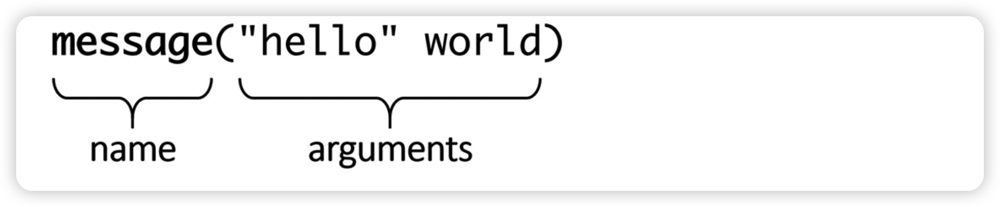

# mcmake
本仓库记录一些 CMake 例子和 CMake 语法规则，以及一些 cmake 命令行和 GUI 界面程序的使用。

第 0-2 三个章节主要是记录一些 CMake 常用的基本概念和知识，并没有深入展开分享。看不懂没关系，从第 3 章开始，遇到前面提到的知识点就会展开分享。不过不要直接跳到第 3 章节开始看，因为前面三个章节介绍了很多基本概念和知识，能够让你对 CMake 有一个感性的认识。并不要求初学者一开始第一遍就看懂这三个章节的内容，有个印象就行了。

特别是第 1-2 两个章节的内容，只是简单列出 CMake 常用的知识点，目的是方便工作在 CMake 工程的时候查阅和复习。

需要提醒一下，本仓库只使用 C++ 语言演示 CMake 项目。

如需交流，请移步微信公众号: eglinux


## 0. CMake 简介
- examples/0/00.cpp
  - g++ 00.cpp

像上面这个例子，如果只有一个或者几个源文件，我们可以简单的自己敲命令进行编译。倘若是一个稍大一点的项目，有很多的源文件，而且这些源文件为了项目的结构清晰，通常会分布在不同的目录，难道我们还是手动去敲命令进行编译吗？那这条命令得有多长？

早期大家喜欢用 Makefile 来组织一个项目的编译构建和安装。就算是现在，仍然有许多的项目在使用 Makefile。

同样也有人喜欢用 [GNU Automake](https://www.gnu.org/software/automake/) 。如果你接触过一些开源项目，我相信你一定对下面这些命令不陌生：

```shell
$ ./configure
$ make
$ make verify   # (optional)
$ sudo make install
```

不错，这就是使用 Automake 管理的编译构建和安装的项目的常规操作。可以看出，其实最终都要和 Makefile 扯上关系。

当然这些都偏向于 Linux 系统上的操作，其实在 Windows 和 macOS 上通常有 IDE 加持，所以很多人就直接不用担心底层到底是怎么编译构建的，只需要按照项目的组织结构直接在 IDE 里面添加源文件就可以了。

但是如果有跨平台的需求，那 IDE 的支持就不是那么好了。

那有没有一种工具，可以管理编译构建和安装，还能够做到跨平台呢？CMake 就是这样的存在，当然除了 CMake，还有其他工具也能做到，比如：[bazel](https://bazel.build/) 、[meson](https://mesonbuild.com/) 、[boost b2](https://www.boost.org/doc/libs/1_79_0/tools/build/doc/html/index.html) 等。

因为本仓库的主角是 CMake，我们就不对其他工具做介绍，也不对这些工具之间做对比，避免无谓的争论不休。

### 0.1. CMake 配置阶段

- 创建一个空的构建目录，并将其工作环境的详细信息收集到其中，例如：系统架构、可用的编译器、链接器、归档器等。
- 尝试测试一个简单的例子，看看是否能正常编译。
- 解析 CMakeLists.txt 文件
  - 项目结构
  - 构建目标
  - 依赖

### 0.2. 生成阶段

- 生成构建系统
- 这个阶段可以通过生成器表达式对构建配置做最后的修改

### 0.3. 构建阶段

- 编译
- 链接
- 单元测试
- 安装
- 打包

看一个简单的例子：

- examples/0

  ```shell
  cd examples/0
  # 配置阶段以及生成阶段合二为一
  cmake -S . -B build
  
  # 构建阶段
  cmake --build build
  ```

## 1. CMake 命令行用法

### 1.1. cmake

- 生成项目的构建系统

  ```shell
  # 推荐用法
  cmake [<options>] -S <path-to-source> -B <path-to-build>

  # 不推荐的用法
  cmake [<options>] <path-to-source>

  # 一般是之前运行过一次，已经生成过
  cmake [<options>] <path-to-existing-build>
  ```

- 指定生成器

  ```shell
  cmake -G <generator-name> -S <path-to-source> -B <path-to-build>
  ```

- 指定工具集和平台

  ```shell
  cmake -G <generator-name> -T <toolset-spec> -A <platform-name> -S <path-to-source> -B <path-to-build>
  ```

- 查看帮助

  ```shell
  cmake --help
  cmake ––help[-<topic>]
  ```

- 指定缓存变量的值

  ```shell
  cmake -D <var>[:<type>]=<value> -S <path-to-source> -B <path-to-build>
  # -D 可以重复多次
  ```

  - 如果要指定的缓存变量太多，可以将要指定的缓存变量用 set() 命令定义，全部写到一个 xxx.cmake 脚本文件中，该 CMake 脚本文件只包含 set() 命令，例如：

    ```cmake
    set(var1 "1111" CACHE STRING "docstring")
    set(var1 "2222" CACHE STRING "docstring")
    set(var1 "3333" CACHE STRING "docstring")
    set(var1 "4444" CACHE STRING "docstring")
    ```

    然后就可以使用 cmake 命令的 -C 选项指定该脚本文件：

    ```shell
    cmake -C xxx.cmake -S <path-to-source> -B <path-to-build>
    ```

  - type 可以是如下值，如果没有指定则为 UNINITIALIZED

    - BOOL
    - FILEPATH
    - PATH
    - STRING
    - INTERNAL

- 取消缓存变量的定义

  ```shell
  cmake -U <globbing_expr> -S <path-to-source> -B <path-to-build>
  # globbing_expr 支持 * 和 ? 通配符
  # -U 可以重复多次
  ```

- 指定构建类型

  ```shell
  cmake -S . -B build -D CMAKE_BUILD_TYPE=Release
  # Debug, Release, MinSizeRel, or RelWithDebInfo.
  ```

- 指定 CMake 输出日志等级

  ```shell
  cmake --log-level=<level>
  # ERROR, WARNING, NOTICE, STATUS, VERBOSE, DEBUG, or TRACE

- 让 CMAKE_MESSAGE_CONTEXT 生效

  - 为了让日志输出有层次感，通常在不同的作用域开始的时候可以使用如下语句增加日志输出层次定义

    ```cmake
    list(APPEND CMAKE_MESSAGE_CONTEXT top)

    # ....

    # 假设这里开启了新的作用域
    list(APPEND CMAKE_MESSAGE_CONTEXT sub)
    ```

  - 为了让上面的定义生效，配置的时候需要给 cmake 传参，如下：

    ```shell
    cmake --log-context -S <path-to-source> -B <path-to-build>
    ```

- 让 CMake 输出更多的详细信息

  ```shell
  cmake --trace
  ```

- cmake 预设

  - 查看可用预设

    ```shell
    cmake --list-presets
    ```

  - 指定预设

    ```shell
    cmake --preset=<preset>
    ```

- 关于缓存变量值覆盖问题

  - -D 指定的缓存变量覆盖预设中定义的缓存变量
  - 预设定义的缓存变量覆盖已有的缓存变量，预设中定义的环境变量覆盖已有的环境变量

- 构建一个项目

  ```shell
  cmake --build <dir> [<options>] [-- <build-tool-options>]
  ```

  - 多线程构建

    ```shell
    cmake --build <dir> --parallel [<number-of-jobs>]
    cmake --build <dir> -j [<number-of-jobs>]
    ```

  - 指定要单独构建的目标

    ```shell
    cmake --build <dir> --target <target1> -t <target2> ...
    ```

  - 清理构建

    ```shell
    cmake --build <dir> -t clean
    ```

  - 指定要构建的类型

    ```shell
    cmake --build <dir> --config <cfg>
    # cfg 可以是：Debug, Release, MinSizeRel, or RelWithDebInfo
    ```

  - 输出构建详细日志

    ```shell
    cmake --build <dir> --verbose
    cmake --build <dir> -v
    ```

- 安装一个项目

  ```shell
  cmake --install <dir> [<options>]
  ```

  - 指定要安装的构建类型

    ```shell
    cmake --install <dir> --config <cfg>
    # cfg 可以是：Debug, Release, MinSizeRel, or RelWithDebInfo
    ```

  - 指定要安装的组建

    ```shell
    cmake --install <dir> --component <comp>
    ```

  - 指定安装的权限

    ```shell
    cmake --install <dir> --default-directory-permissions <permissions>
    # permissions 格式：u=rwx,g=rx,o=rx
    ```

  - 指定安装目录前戳

    ```shell
    cmake --install <dir> --prefix <prefix>
    ```

  - 安装的时候输出详细日志

    ```shell
    cmake --install <dir> --verbose
    cmake --install <dir> -v
    ```

- 运行一个 CMake 脚本

  ```shell
  cmake [{-D <var>=<value>}...] -P <cmake-script-file> [-- <unparsed-options>...]
  # [-- <unparsed-options>...] 传递的参数，CMake 通过 CMAKE_ARGV<n> 变量来接收
  ```

- 运行其他工具命令

  ```shell
  cmake -E <command> [<options>]
  # 例如：cat, chdir, compare_files, copy, copy_directory, copy_if_different, echo, echo_append 等
  ```

### 1.2. ctest

### 1.3. cpack

## 2. CMake 语言语法规则

### 2.1. 注释

- 单行注释

  ```cmake
  # single-line comments start with a hash sign "#"
  # they can be placed on an empty line
  #
  message("Hi"); # or after a command like here.
  ```

- 括号注释

  ```cmake
  #[=[
  括号注释
    支持嵌套多行注释
    #[[
      nested bracket comment
    #]]
  #]=]
  ```

  - 如果需要取消多行注释，直接在 #[=[ 前再加一个 #，知道 lua 语言的注释的朋友对此应该不陌生。

### 2.2. CMake 命令



- 命令分类
  - 脚本命令
  - 项目命令
  - CTest 命令

- 命令参数
  - 不带引号的参数

    ```cmake
    message(a\ single\ argument)
    message(two arguments)
    message(three;separated;arguments)
    message(${CMAKE_VERSION})  # a variable reference
    message(()()())            # matching parentheses
    ```

  - 带引号的参数

    ```cmake
    message("1. escape sequence: \" \n in a quoted argument")
    message("2. multi...
      line")
    message("3. and a variable reference: ${CMAKE_VERSION}")
    ```

  - 括号参数

    ```cmake
    message([[multiline
        bracket
        argument
    ]])
    message([==[
        because we used two equal-signs "=="
        following is still a single argument:
        { "petsArray" = [["mouse","cat"],["dog"]] }
    ]==])
    ```

### 2.3. 变量

- set() 命令定义变量

  ```cmake
  set(MyString1 "Text1")
  set([[My String2]] "Text2")
  set("My String 3" "Text3")

  # ${} 可以引用变量，支持嵌套，评估的时候先里后外
  message(${MyString1})
  message(${My\ String2})
  message(${My\ String\ 3})
  ```

  - 定义普通变量

    ```cmake
    set(varName value... [PARENT_SCOPE])
    ```

  - 普通变量引用

    ```cmake
    ${}
    ```

  - 定义和取消环境变量

    ```cmake
    # set(ENV{<variable>} <value>)
    # unset(ENV{<variable>})
    set(ENV{CXX} "clang++")
    ```

  - 环境变量引用

    ```cmake
    $ENV{}
    ```

  - 定义缓存变量

    ```cmake
    # set(<variable> <value> CACHE <type> <docstring> [FORCE])
    set(FOO "BAR" CACHE STRING "interesting value")
    # type 可以是: BOOL、FILEPATH、PATH、STRING、INTERNAL
    ```

    - 给 STRING 类型的缓存变量设置属性

      ```cmake
      set_property(CACHE <variable> STRINGS <values>).

  - 缓存变量引用

    ```cmake
    $CACHE{}
    ```

  - lists

    ```cmake
    set(myList "a;list;of;five;elements")
    set(myList a list "of;five;elements")
    ```

- list() 命令

  ```cmake
  list(LENGTH <list> <out-var>)
  list(GET <list> <element index> [<index> ...] <out-var>)
  list(JOIN <list> <glue> <out-var>)
  list(SUBLIST <list> <begin> <length> <out-var>)
  list(FIND <list> <value> <out-var>)
  list(APPEND <list> [<element>...])
  list(FILTER <list> {INCLUDE | EXCLUDE} REGEX <regex>)
  list(INSERT <list> <index> [<element>...])
  list(POP_BACK <list> [<out-var>...])
  list(POP_FRONT <list> [<out-var>...])
  list(PREPEND <list> [<element>...])
  list(REMOVE_ITEM <list> <value>...)
  list(REMOVE_AT <list> <index>...)
  list(REMOVE_DUPLICATES <list>)
  list(TRANSFORM <list> <ACTION> [...])
  list(REVERSE <list>)
  list(SORT <list> [...])
  ```

### 2.4. CMake 流程控制

- if() 命令

  ```cmake
  if(<condition>)
    	<commands>
  elseif(<condition>) # optional block, can be repeated
    	<commands>
  else()              # optional block
    	<commands>
  endif()
  ```

  - condition 变体

    ```cmake
    if(NOT <condition>)
    if(<condition> AND <condition>)
    if(<condition> OR <condition>)
    if((<condition>) AND (<condition> OR (<condition>)))

    if(DEFINED <name>)
    if(DEFINED CACHE{<name>})
    if(DEFINED ENV{<name>})

    if (1 LESS 2)
    # EQUAL, LESS, LESS_EQUAL, GREATER, and GREATER_EQUAL

    if (1.3.4 VERSION_LESS_EQUAL 1.4)

    if ("A" STREQUAL "${B}")

    if(<VARIABLE|STRING> MATCHES <regex>)
    # CMAKE_MATCH_<n>

    if(<VARIABLE|STRING> IN_LIST <VARIABLE>)

    if(COMMAND <command-name>)
    if(POLICY <policy-id>)
    if(TEST <test-name>)
    if(TARGET <target-name>)

    if(EXISTS <path-to-file-or-directory>)
    if(<file1> IS_NEWER_THAN <file2>)
    if(IS_DIRECTORY path-to-directory)
    if(IS_SYMLINK file-name)
    if(IS_ABSOLUTE path)
    ```

  - 如果 condition 是一个字符串，那只有和以下值相等的时候条件块才为真

    - `ON`, `Y`, `YES`, or `TRUE`
    - 一个非 0 数字

    不过需要注意：如果 condition 是一个没引号的字符串，只有其不等于如下值时才会将其视为一个变量去评估:

    - `OFF`, `NO`, `FALSE`, `N`, `IGNORE`, `NOTFOUND`
    - 以 -NOTFOUND 结尾的字符串
    - 空字符串
    - 0

- 循环

  ```cmake
  while(<condition>)
    	<commands>
  endwhile()
  ```

  ```cmake
  foreach(<loop_var> RANGE <max>)
    	<commands>
  endforeach()
  
  foreach(<loop_var> RANGE <min> <max> [<step>])
  
  foreach(<loop_variable> IN [LISTS <lists>] [ITEMS <items>])
  
  foreach(<loop_var>... IN ZIP_LISTS <lists>)
  ```

  ```cmake
  set(L1 "one;two;three;four")
  set(L2 "1;2;3;4;5")
  foreach(num IN ZIP_LISTS L1 L2)
      message("num_0=${num_0}, num_1=${num_1}")
  endforeach()
  
  # -----------------------------------------------
  foreach(word num IN ZIP_LISTS L1 L2)
      message("word=${word}, num=${num}")
  endforeach()
  ```

  ```cmake
  break()
  continue()
  ```


### 2.5. 自定义命令

- 宏

  ```cmake
  macro(<name> [<argument>…])
    	<commands>
  endmacro()
  ```

- 函数

  ```cmake
  function(<name> [<argument>…])
    	<commands>
    	return()
  endfunction()
  ```

- 命令参数解析

  - ${ARGC}
  - ${ARGV}
  - ${ARG0}, ${ARG1}, ${ARG2}
  - ${ARGN}

### 2.6. 实用命令

- message()

  ```cmake
  message(<MODE> "text")
  # FATAL_ERROR、SEND_ERROR、WARNING、AUTHOR_WARNING、DEPRECATION、NOTICE、STATUS、VERBOSE、DEBUG、TRACE
  ```

- include()

  ```cmake
  include(<file|module> [OPTIONAL] [RESULT_VARIABLE <var>])
  ```

- inclue_guard()

  ```cmake
  include_guard([DIRECTORY|GLOBAL])
  # DIRECTORY 保护当前目录及其之下的目录
  # GLOBAL 保护整个构建
  ```

- file()

  ```cmake
  file(READ <filename> <out-var> [...])
  file({WRITE | APPEND} <filename> <content>...)
  file(DOWNLOAD <url> [<file>] [...])
  ```

- execute_process()

  ```cmake
  execute_process(COMMAND <cmd1> [<arguments>]… [OPTIONS])
  # TIMEOUT <seconds>
  # WORKING_DIRECTORY <directory>
  # RESULTS_VARIABLE <variable>
  # RESULT_VARIABLE <variable>
  
  # OUTPUT_VARIABLE 指定变量接收 stdout 输出
  # ERROR_VARIABLE 指定变量接收 stderr 输出
  # 如果想 stdout 和 stderr 输出在一起，则指定成同一个变量即可
  ```

## 3. CMake 实战

通过上面三个章节的 CMake 基础知识的梳理，我相信大家对 CMake 已经有了一些了解了。当然前面三个章节的知识点并没有详细展开说明，只是把常用的一些知识点列出来，目的是为了方便查询和复习。

如果大家对其中的某个知识点感兴趣可以自行查阅相关资料深入学习，也可以和我一起交流。当然后面的分享也会包括其中一些知识点的深入讨论，如果不是太着急要搞明白，我还是建议通篇依次阅读本文档进行 CMake 的学习。

从本章节开始，我会从小项目开始，介绍 CMake 在实际开发中该怎么使用，最后会综合这些使用方法，总结如何使用 CMake 组织大型项目。

### 3.1. 指定 CMake 最小版本

请记住，开始写 CMakeLists.txt 或者 .cmake 脚本的第一件事就是要想清楚自己需要的 CMake 最小版本。

对于新开的项目，不要犹豫，直接选择 cmake 官网的最新稳定版本作为项目的最小 CMake 版本。因为 CMake 安装包很完善，每个平台都能轻松安装最新版本的 CMake，所以不要担心指定太行的 CMake 版本作为最小版本会遇到麻烦，这样给你带来的只有好处。

为了驱动项目合作伙伴也使用最新版本的 CMake，不妨使用下面这条语句，迫使大家都使用最新版本。

```cmake
cmake_minimum_required(VERSION 3.23 FATAL_ERROR)
# 写作本文档时，CMake 的最新版本时 3.23.2
# 加上 FATAL_ERROR 关键字后，如果使用的版本低于 3.23，那 CMake 将在配置的时候发出错误并结束处理
```

另外，上面这条语句应该加在顶级 CMakeLists.txt 的第一行，如果是一个 .cmake 脚本文件， 那第一行也要加上上面这条语句。其他子目录的 CMakeLists.txt 就不建议再包含该语句了，如果要包含，切记要和顶级目录中的该语句一模一样，确保是相同的版本号。

因为 CMake 在通过上面这条语句声明 CMake 的最小版本的同时，也引入了相应的 CMake 策略。关于 CMake 策略这里不展开描述，后续会专门讲解。你只需要知道不同的 CMake 策略会导致 CMake 的行为有所差异就行了。

当我们在 CMakeLists.txt 中写下上面这条语句的时候，相当于隐式调用了一条设置 CMake 策略的语句，如下：

```cmake
cmake_policy(VERSION)
# 这里的 VERSION 要替换成相应的策略版本号，例如 CMake 3.23 的策略版本号是 CMP0129
# 也就是在真实的项目中，如果我们要显示的设置 CMake 策略，语句类似这样的：cmake_policy(CMP0129)
```

不同 CMake 版本的策略版本号可以在 CMake 官网查到：[cmake 策略](https://cmake.org/cmake/help/v3.23/manual/cmake-policies.7.html)

不过只要我们确 cmake_minimum_required() 命令指定的最小版本是最新的 CMake 版本，一般不用考虑 CMake 策略的事情，除非是要维护老版本 CMake 项目。这也是推荐大家在 CMakeLists.txt 中指定最新版本作为当前项目的最小 CMake 版本的原因。

### 3.2. 定义一个项目

- 定义项目的命令

  ```cmake
  project(<PROJECT-NAME> [<language-name>...])
  project(<PROJECT-NAME>
      [VERSION <major>[.<minor>[.<patch>[.<tweak>]]]]
      [DESCRIPTION <project-description-string>]
      [HOMEPAGE_URL <url-string>]
      [LANGUAGES <language-name>...]
  )

可以看到，定义项目，我们可以使用两种形式，如果是想要作为单独的项目，建议使用第二种形式，如果只是作为一个大项目中的小项目，建议使用第一种形式。

也就是说，如果要作为一个单独的项目存在，那在顶级目录的 CMakeLists.txt 中就推荐使用第二种形式定义一个总的项目，在该项目的子目录中，如果有需要，可以使用第二种形式定义一些子项目。

这里提到了子目录，CMake 支持安装源码的目录结构使用 CMakeLists.txt 组织 CMake 项目，也就是说，每一个子目录都可以有一个单独的 CMakeLists.txt 文件，然后使用 CMake 包含子目录的机制将这些分散在各个目录的 CMakeLists.txt 联系起来，这个后面会讲到。

- 说明一下：
  - 上面这种命令我成为 CMake 命令的签名，在实际项目中，某些字段是要替换成我们自己的值的。
  - 其中 <> 包含的字段是必填项
  - [  ] 包含的字段是可选项
  - 每个 CMakeLists.txt 中只能有一条 project() 命令

当我们在 CMakeLists.txt 中写下上述两种形式的命令时，CMake 都会隐式生成一些变量并初始化。如下：

```cmake
# PROJECT_NAME					# <PROJECT-NAME> 的指定的值
# CMAKE_PROJECT_NAME 		# 顶级目录中的 CMakeLists 定义项目的时候 <PROJECT-NAME> 的指定的值
# PROJECT_SOURCE_DIR、PROJECT-NAME>_SOURCE_DIR # 定义项目的时候 CMakeLists.txt 所在的目录
# ROJECT_BINARY_DIR、<PROJECT-NAME>_BINARY_DIR # 定义项目的时候，生成该项目二进制文件存放的目录
```

- 支持的语言

  ```cmake
  # [<language-name>...] 可选参数可以指定如下语言：
  # C, CXX (C++), CUDA, OBJC (Objective-C), OBJCXX (Objective C++), Fortran, ISPC, ASM, CSharp (C#) 和 Java
  ```

  如果没有指定，CMake 会默认指定为 C CXX

  建议如果明确只使用一种语言，那就一定要指定，否则 CMake 默认会去探测 C 和 C++ 的编译器信息，假如我们只使用 C++ 语言，那探测 C 语言编译器的时间就不应该出现。

- 指定项目版本号

  - 对于顶级 CMakeLists.txt 中定义的项目，建议写上版本号，这样也方便做版本发布。

  - 如果指定了版本号，CMake 会隐式生成如下变量

    ```cmake
    # PROJECT_VERSION, <PROJECT-NAME>_VERSION
    # CMAKE_PROJECT_VERSION (只有顶级 CMakeLists.txt 才会生成该变量)
    # PROJECT_VERSION_MAJOR, <PROJECT-NAME>_VERSION_MAJOR
    # PROJECT_VERSION_MINOR, <PROJECT-NAME>_VERSION_MINOR
    # PROJECT_VERSION_PATCH, <PROJECT-NAME>_VERSION_PATCH
    # PROJECT_VERSION_TWEAK, <PROJECT-NAME>_VERSION_TWEAK
    ```

你可能会问，CMake 为什么要隐式生成上述这些变量，不要着急，我们后面会用到，到时候你就知道这些变量带来的便利了。

### 3.3. 让 CMake 日志更友好

### 3.4. 禁止源内构建

### 3.5. 配置 C++ 工具链

### 3.6. 定义目标

### 3.3. 考虑如何组织代码结构

